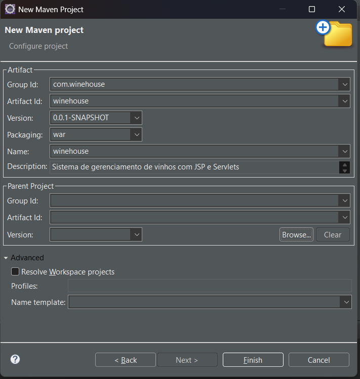

# 🍷 WineHouse - Sistema de Gerenciamento de Vinhos

## 📌 Sobre o Projeto

O **WineHouse** é uma aplicação web desenvolvida com **JavaServer Pages (JSP)**, **Servlets** e **MySQL**, com o objetivo de gerenciar um catálogo de vinhos.

O sistema permite realizar operações completas de cadastro, consulta, edição e exclusão de vinhos, simulando o funcionamento de uma adega ou loja especializada.

---

## 🚀 Tecnologias Utilizadas

- Java JDK 17  
- JSP (JavaServer Pages)  
- Servlets  
- JDBC  
- MySQL  
- Apache Tomcat 10  
- Maven  
- HTML e CSS  

---

## 📂 Estrutura do Projeto

```bash
winehouse/
├── src/main/java/
│   ├── controller/
│   │   └── VinhoServlet.java
│   ├── dao/
│   │   └── VinhoDAO.java
│   ├── model/
│   │   └── Vinho.java
│   └── util/
│       └── ConnectionFactory.java
│
├── src/main/webapp/
│   ├── views/
│   │   ├── listar-vinhos.jsp
│   │   ├── form-vinho.jsp
│   │   └── detalhes-vinho.jsp
│   ├── css/
│   │   └── style.css
│   └── index.jsp
│
└── pom.xml
```

---

## ⚙️ Funcionalidades

- ✔️ Cadastro de vinhos  
- ✔️ Listagem de vinhos  
- ✔️ Edição de vinhos  
- ✔️ Exclusão de vinhos  
- ✔️ Visualização de detalhes  

---

## 🗄️ Banco de Dados

### Criar o banco e a tabela

Execute o seguinte script no MySQL:

```sql
CREATE DATABASE winehouse;
USE winehouse;

CREATE TABLE vinhos (
    id INT PRIMARY KEY AUTO_INCREMENT,
    nome VARCHAR(100) NOT NULL,
    tipo VARCHAR(50) NOT NULL,
    pais VARCHAR(50) NOT NULL,
    safra INT NOT NULL,
    preco DECIMAL(10,2) NOT NULL,
    descricao TEXT
);
```

---

## 🔌 Configuração do Banco no Projeto

No arquivo:

ConnectionFactory.java

Configure com seus dados:

```java
private static final String URL = "jdbc:mysql://localhost:3306/winehouse";
private static final String USER = "root";
private static final String PASSWORD = "SUA_SENHA";
```

---

## 🛠️ Configuração do Ambiente

### 1. Pré-requisitos

- JDK 17 instalado  
- XAMPP (ou MySQL)  
- Apache Tomcat 10  
- Eclipse IDE  
- Maven  

---

### 2. Criar o projeto no Eclipse

1. File → New → Maven Project  
2. Preencher:
   - Group Id: com.winehouse  
   - Artifact Id: winehouse  
   - Packaging: war  
3. Finalizar o projeto  



---

### 3. Configurar o Java

- Definir JDK 17 no projeto  
- Ajustar:
  - Java Build Path  
  - Java Compiler → versão 17  

---

### 4. Configurar o Tomcat

1. Adicionar o servidor no Eclipse  
2. Selecionar Tomcat 10  
3. Associar o projeto ao servidor  

---

### 5. Configurar o Maven

Atualizar dependências:

Right click no projeto → Maven → Update Project

---

## ▶️ Executando o Projeto

1. Inicie o MySQL (XAMPP ou outro)  
2. Execute o projeto no Tomcat  
3. Acesse no navegador:

```http://localhost:8080/winehouse/```

---

## 🧪 Fluxo de Uso

1. Acessar o sistema  
2. Cadastrar um novo vinho  
3. Visualizar a lista de vinhos  
4. Editar ou excluir registros  
5. Ver detalhes de um vinho  

---

## 📈 Possíveis Melhorias

- Upload de imagem do vinho  
- Filtros de busca avançados  
- Sistema de login  
- Interface responsiva  
- Avaliação por estrelas  

---

## 👨‍💻 Autor

Projeto desenvolvido para fins acadêmicos na disciplina de Desenvolvimento Web.

---

## 📄 Licença

Uso livre para fins educacionais.
